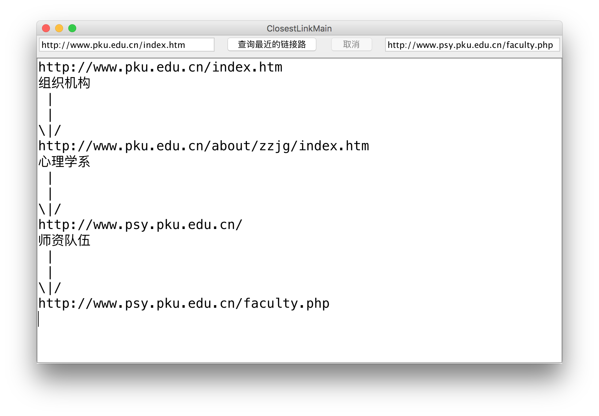

# Spider
- Java Class Assignment
- 一个小爬虫，可以找到从一个URL到另一个URL之间的最短链接路径
- 如
- 可执行的jar位于[./out/artifacts/Spider_jar/Spider.jar](./out/artifacts/Spider_jar/Spider.jar)
- [Github地址](https://github.com/HackAll-PKU/Spider)

## 项目结构
- 在intelliJ环境下构建
- ClosestLinkMain为主类，从此处启动
- SearchWorker为搜索工作的执行类
- SearchNode是搜索工作的节点类
- 使用HttpKit进行网络请求
- 建议尝试从 https://its.pku.edu.cn 到 http://www.sina.com.cn 

## 亮点
- 采用多线程
- 使用BFS算法并加以优化
- 很有意思↖(^ω^)↗，能够发现意想不到的链接路，如 https://its.pku.edu.cn 到 http://www.sina.com.cn 只要三步，你能猜到吗😝

## 缺点
- 受到网络IO瓶颈的限制，三层以上的搜索较慢
- 界面稍微简陋了些，毕竟这次作业重点在于网络请求和正则表达式😌

## P.S.
- 其实我们本来想做的是在百度上查各种医药名词，来看从第几个词条开始才是非推广链接
- 所以项目目录里面[/keywords.txt](./keywords.txt)中有各种医药名词
- [/src/com/hackerall/Spider/Filter.java](./src/com/hackerall/Spider/Filter.java)是原来做百度爬虫的主类
- 但是最后发现百度已经进行了清除，几乎不剩广告了，所以感觉不太有意思就没有做下去

## 作者
- D34 陈乐天
- D35 寇雨婷
- D36 胡顺昕

